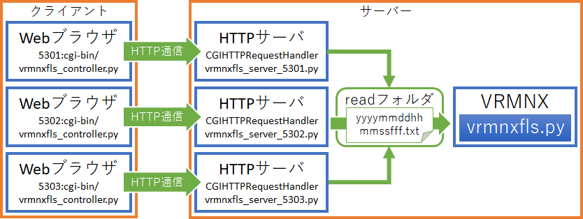
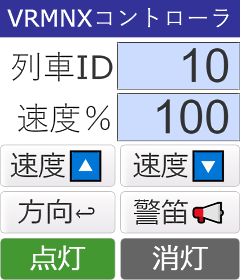
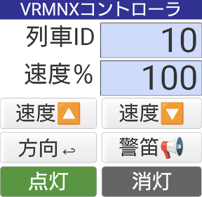
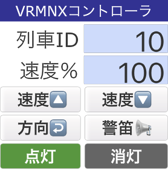

# VRMNX Webコントローラ
## 概要
「VRMNX Webコントローラ」は「[鉄道模型シミュレーターNX](http://www.imagic.co.jp/hobby/products/vrmnx/ "鉄道模型シミュレーターNX")」（VRMNX）で動作する「[VRMNXファイル連携システム](https://github.com/CaldiaNX/vrmnxfls)」（VRMNX File linkege System：VRMNX FLS）に対応したWebブラウザ対応コントローラです。  
Webブラウザ等からPOSTした列車IDと速度や命令をPythonのHTTPサーバ（cgi-bin）で受け取り、「VRMNXファイル連携システム」に対応した命令ファイルを作成します。  
命令ファイルを「read」フォルダ経由で「VRMNXファイル連携システム」と連携させることで、パソコンやスマートフォンのWebブラウザから「鉄道模型シミュレーターNX」を操作することができます。  




## 前提環境
### Pythonインストール
「鉄道模型シミュレーターNX」が動作するWindowsOSへのPythonインストールが必要です。  
「Python 3.9.6」での実行を確認しています。  

### ポート開放
外部から操作する場合はルータやWindowsファイアウォールのポート開放が必要です。  
サンプルでは5301～5303ポートを利用して3編成を同時操作できるように用意しています。  
サービスを複製したりポート番号を変更する場合は環境に合わせて変更してください。  


## 実行方法
「Code」→「Download ZIP」からダウンロードしたzipファイルを任意のフォルダに展開します。  

フォルダ構成例：
```
C:
├ \Python
│ └ \Python39 # Pythonインストールフォルダ
└ \VRMNX
   ├ \read     # 命令ファイル出力先
   └ \http     # ダウンロードしたフォルダ
      ├ vrmnxfls_controller.css   # WebコントローラCSS
      ├ vrmnxfls_controller.html  # WebコントローラHTML
      ├ vrmnxfls_server_5301.py   # HTTPサーバモジュール(5301ポート)
      ├ vrmnxfls_server_5302.py   # HTTPサーバモジュール(5302ポート)
      ├ vrmnxfls_server_5303.py   # HTTPサーバモジュール(5303ポート)
      ├ vrmnxfls_server_start.bat # HTTPサーバ開始用バッチ
      └ \cgi-bin
         └ vrmnxfls_controller.py # 命令ファイル出力モジュール
```

httpフォルダはVRMNXと異なるフォルダでも動きます。  
フォルダ構成が異なる場合は下記のパラメータを書き換えてください。

|ファイル名|設定値例|説明|
|----------|--------|----|
|vrmnxfls_controller.py| C:\\VRMNX\\read\\ | VRMNXFLS用ファイル出力先 |
|vrmnxfls_server_start.bat| C:\Python\Python39 | Pythonインストールフォルダ |
|vrmnxfls_server_start.bat| ?slt1=10 | 操作対象のVRMNX列車ID |
|vrmnxfls_server_start.bat| localhost | サーバ先。初期値はPC内のみ。自宅内の別端末から接続する場合はLANのIPアドレス、外部から接続する場合はインターネットのグローバルIPアドレスを設定する。 |

「vrmnxfls_server_start.bat」を実行するとバッチファイルに登録されている3つのサンプルサーバが起動し、それぞれに対するWebブラウザも立ち上がります。  





画面を操作することでreadフォルダへ命令ファイルが出力されます。  
終了する場合はWebブラウザを閉じてコマンドプロンプトを終了してください。  


## コマンド実行

curl等のコマンド実行も可能です。  

```cmd
rem 速度UP（クエリパラメータから速度を10上げます。上限は100です）
curl "http://localhost:5301/cgi-bin/vrmnxfls_controller.py?slt1=10&spd1=10&up1=."
rem 速度DOWN（クエリパラメータから速度を10下げます。下限は0です）
curl "http://localhost:5301/cgi-bin/vrmnxfls_controller.py?slt1=10&spd1=90&dn1=."
rem 方向転換
curl "http://localhost:5301/cgi-bin/vrmnxfls_controller.py?slt1=10&spd1=0&tn1=."
rem 警笛
curl "http://localhost:5301/cgi-bin/vrmnxfls_controller.py?slt1=10&hn1=."
rem 点灯
curl "http://localhost:5301/cgi-bin/vrmnxfls_controller.py?slt1=10&pwon1=."
rem 消灯
curl "http://localhost:5301/cgi-bin/vrmnxfls_controller.py?slt1=10&pwof1=."
```


## 注意点

本システムはローカル動作用の実験目的コードであり、セキュリティを考慮していません。  
パブリックな環境で利用する場合はHTTPS化やワンタイムURL等、セキュリティを考慮してください。  
PythonのHTTPServerがシングルスレッドで動作しているため連打などで処理が重なるとクラッシュする可能性があります。  
上記理由により複数クライアントとの接続サーバを多重起動して1対1の接続を推奨します。  


## 今後の機能拡張構想（妄想段階）
- ポイント操作を含めた運転制御盤
- マルチデバイス対応（共通デザイン化）
- カメラ操作
- セキュリティ、安定性の向上
- 複数ユーザ対応（HTTPサーバのマルチスレッド化）
- WebSocketやSPDYを使用したレイアウト情報のリアルタイム伝達